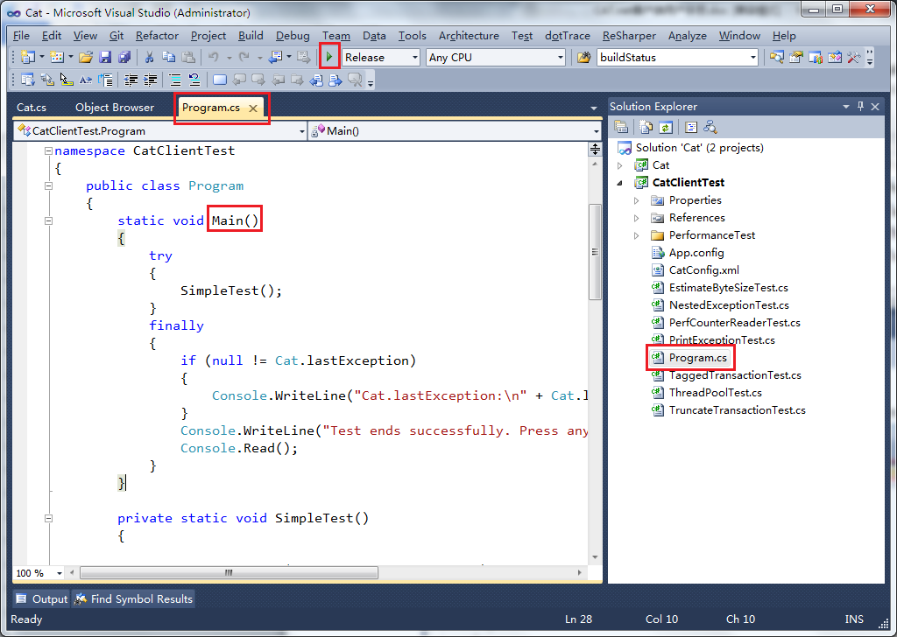
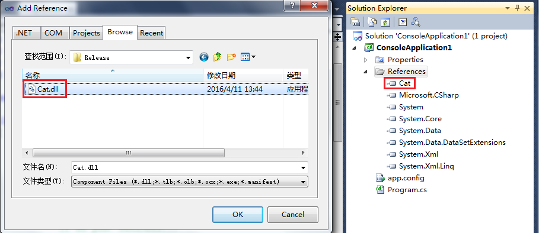
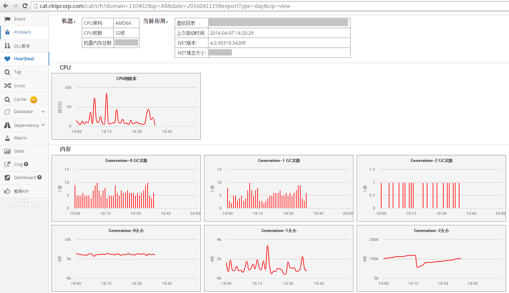

# CAT.net客户端 [](https://travis-ci.org/ctripcorp/cat.net)
为.net应用提供接入CAT的API。

CAT.net客户端的API设计、客户端配置方式，与[CAT Java客户端](https://github.com/dianping/cat)基本一致。

### 编译工程
CAT.net客户端要求**_.NET Framework 4.0或更高版本_**。

用Visual Studio 2010或更高版本，打开Cat\Cat.sln。可以看到Solution中包括两个工程：

1. `Cat`：CAT.net客户端实现代码
2. `CatClientTest`：示例程序和测试用例。

单击Rebuild Solution编译这两个工程：


编译的输出是`Cat.dll`，如下图。在业务应用的工程中，通过引用这个dll，调用其中的API，来接入CAT。


### 配置
1. 创建以下目录，确保执行CAT客户端的帐户有权限读写它们：
  - `d:\data\appdatas\cat\`  (CAT客户端使用的临时数据目录)
  - `d:\data\applogs\cat\`  (CAT客户端的日志输出目录)
2. 创建`d:\data\appdatas\cat\client.xml`。在其中配置Domain ID和CAT服务器地址。推荐client.xml用**_UTF-8_**编码。client.xml内容如下：
```
<?xml version="1.0" encoding="utf-8"?>
<config mode="client" enabled="true" queue-size="123">
	<!--logEnabled enabled="true"></logEnabled-->
	
	<!-- 配置Domain ID-->
	<domain id="1237" enabled="true" max-message-size="1000"/>
	
	<servers>
		<!-- 配置CAT服务器地址-->
		<server ip="10.2.6.98" port="2280" http-port="8080"></server>
	</servers>
</config>
```

### 执行工程自带的测试用例
- 设置CatClientTest工程为默认启动工程：


- 单击执行，就会运行`CatClientTest`中的`Program.cs`的`Main()`方法。


程序输出：


- 在CAT中可以看到测试程序的CAT埋点，如下图。其中的CAT服务器地址、Domain ID应该与client.xml中的配置一致。


### 在其他应用中引用`Cat.dll`，调用CAT API
- 假设我们有一个console应用。

确保工程使用了.NET Framework 4.0或更高版本的服务端Profile，而**_不是Client Profile_**。

- 添加对`Cat.dll`的引用

- 调用CAT API埋点。示例代码：
```
using System;
using System.Collections.Generic;
using System.Linq;
using System.Text;
using Org.Unidal.Cat.Message;
using Org.Unidal.Cat;
using System.Threading;

namespace ConsoleApplication1
{
    class Program
    {
        static void Main(string[] args)
        {
            ITransaction transaction = null; ;
            try
            {
                transaction = Cat.NewTransaction("Order", "Cash");

                // Do your business...

                Cat.LogEvent("City", "Shanghai");
                transaction.Status = CatConstants.SUCCESS;
            }
            catch (Exception ex)
            {
            	Cat.LogError(ex);
                transaction.SetStatus(ex);
                
                // You may need to re-throw exception ex out.
            }
            finally
            {
                transaction.Complete();

                // 程序退出前睡一会儿。使得CAT客户端有时间发出最后一批消息到网络。
                Thread.Sleep(1000);
            }
        }
    }
}
```
- 执行以上`Main()`方法。
- 在CAT中可以看到埋点效果：


### 日志输出
- 在client.xml中，启用`<logEnabled enabled="true"></logEnabled>` XML元素，以开启日志输出。
- 日志输出位于`D:\data\applogs\cat`目录中：


### 为心跳报表获取.NET性能数据

如上图，CAT.net客户端每分钟会自动抓取一次机器性能数据，展现在Heartbeat报表中，包括CPU利用率、GC次数、Heap各代大小、锁竞争次数、锁请求队列大小等。

这些性能指标中的一部分，是通过读取.NET Performance Counter实现的。
（见`DefaultPerformanceMetricProvider.cs`中的`Initialize()`，如下图）。


然而，读取.NET Performance Counter，需要执行应用所使用的帐户是**_Performance Log Users_**用户组的成员（参考这里）。特别地，在IIS中以普通账户（`IIS_USRS`）执行的Web应用，是没有这个权限的。

所以，您可能需要提供自己的`IPerformanceMetricProvider`实现，它通过其他有权限读取的数据源（如Zabbix Agent，Salt Agent，或自己实现的一个有更高执行权限的Performance Counter输出程序）来获取这些性能指标。
	
在您的实现中，对于`IPerformanceMetricProvider`接口中`的Get*()`方法，它应当返回**过去1分钟内**的某个性能指标的累积值（如GC次数），或**过去1分钟内**的平均值（如CPU利用率）。 不推荐它返回从**程序启动至今**的累积值/平均值。请参考`DefaultPerformanceMetricProvider`是如何遵循这一语义的。

通过修改`StatusUpdateTask.cs`，用您的`IPerformanceMetricProvider`实现，来替换掉`DefaultPerformanceMetricProvider`这个默认实现，如下图。


