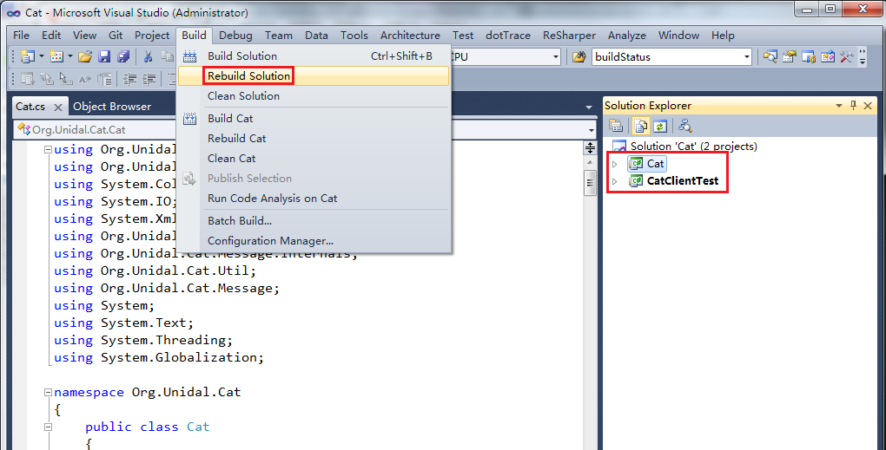

# CAT.net客户端
为.net应用提供接入CAT的API。

CAT.net客户端的API设计、客户端配置方式，与[CAT Java客户端](https://github.com/dianping/cat)基本一致。

### 编译工程
CAT.net客户端要求**.NET Framework 4.0或更高版本**。

用Visual Studio 2010或更高版本，打开Cat\Cat.sln。可以看到Solution中包括两个工程：

1. `Cat`：CAT.net客户端实现代码
2. `CatClientTest`：示例程序和测试用例。

单击Rebuild Solution编译这两个工程：


编译的输出是Cat.dll，如下图。在业务应用的工程中，通过引用这个dll，调用其中的API，来接入CAT。


### 配置
1. 创建以下目录，确保执行CAT客户端的帐户有权限读写它们：
  - `d:\data\appdatas\cat\`  (CAT客户端使用的临时数据目录)
  - `d:\data\applogs\cat\`  (CAT客户端的日志输出目录)
2. 创建`d:\data\appdatas\cat\client.xml`。在其中配置Domain ID和CAT服务器地址。推荐client.xml用**UTF-8**编码。client.xml内容如下：
```
<?xml version="1.0" encoding="utf-8"?>
<config mode="client" enabled="true" queue-size="123">
	<!--logEnabled enabled="true"></logEnabled-->
	
	<!-- 配置Domain ID-->
	<domain id="1237" enabled="true" max-message-size="1000"/>
	
	<servers>
		<!-- 配置CAT服务器地址-->
		<server ip="10.2.6.98" port="2280" http-port="8080"></server>
	</servers>
</config>
```

### 执行工程自带的测试用例
1. 设置CatClientTest工程为默认启动工程：


2. 单击执行，就会运行CatClientTest中的Program.cs的Main()方法。


程序输出：


